# Задание 2. Динамическое масштабирование контейнеров

### 1. Динамическая маршрутизация на основании показателей утилизации памяти

1.  Поднимаем локальный кластер Kubernetes в Minikube

```bash
minikube start
```

2. Активируем метрики

```bash
minikube addons enable metrics-server
```

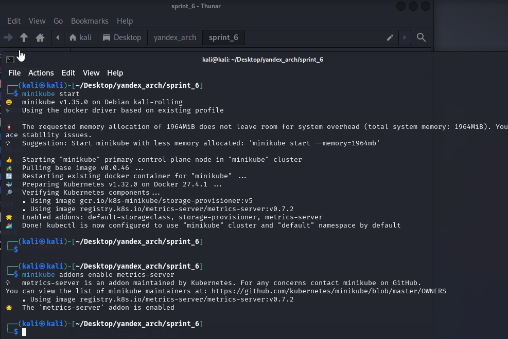

3. Делаем развертывание (Deployment) Kubernetes для запуска тестового приложения

```bash
kubectl apply -f deployment.yaml
```

4. Применяем манифест Service

```bash
kubectl apply -f service.yaml
```

5. Настраиваем динамическую маршрутизацию на основании показателей утилизации оперативной памяти с помощью Horizontal Pod Autoscaler (HPA).

```bash
kubectl apply -f hpa.yaml
```

6. Активируем поддержку метрик в нашем кластере

```bash
minikube addons enable metrics-server
```

7. Сделал в 5 пункте

   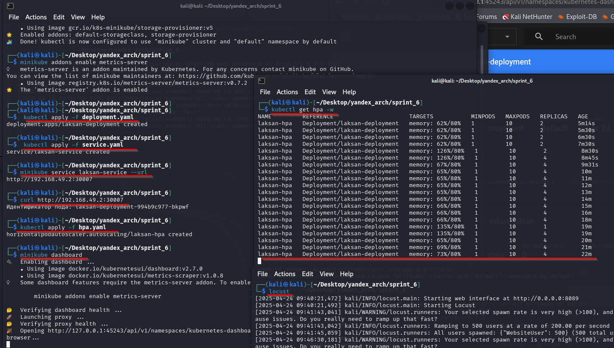

8. Проверка масштабируемости подов через нагрузку Locust

```bash
locust

minikube dashboard
```

Скриншот Статистики запросов в Locust
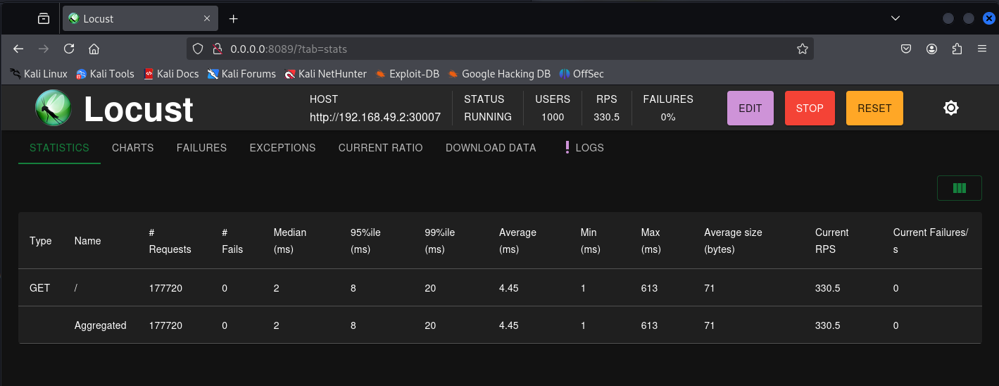

Скриншот Диаграмм в Locust
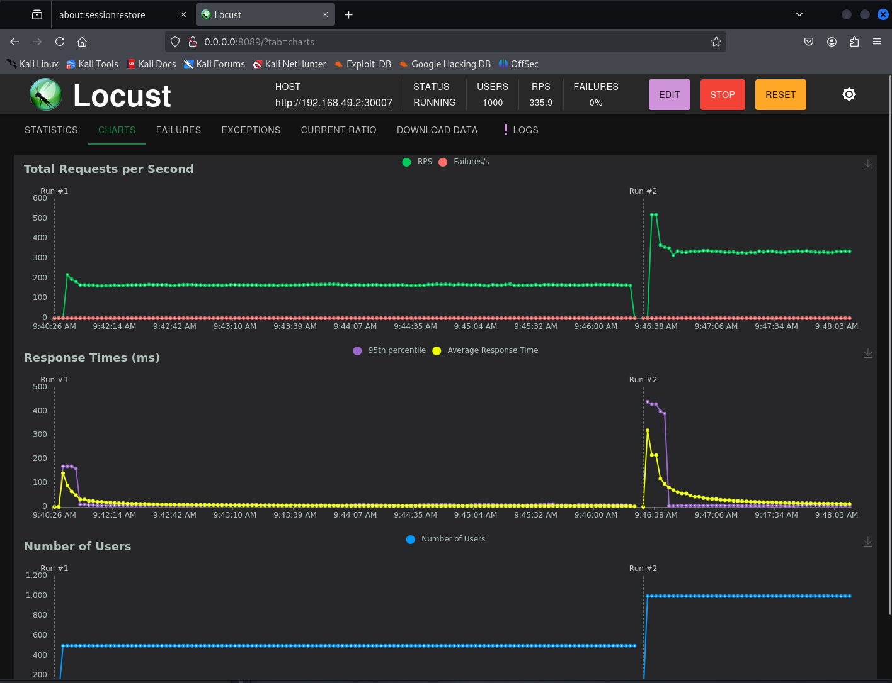

Скриншот Dashboard для нагрузки USERS: 1000 и RPS: 330
Видим, что количество подов выросло до 4 подов
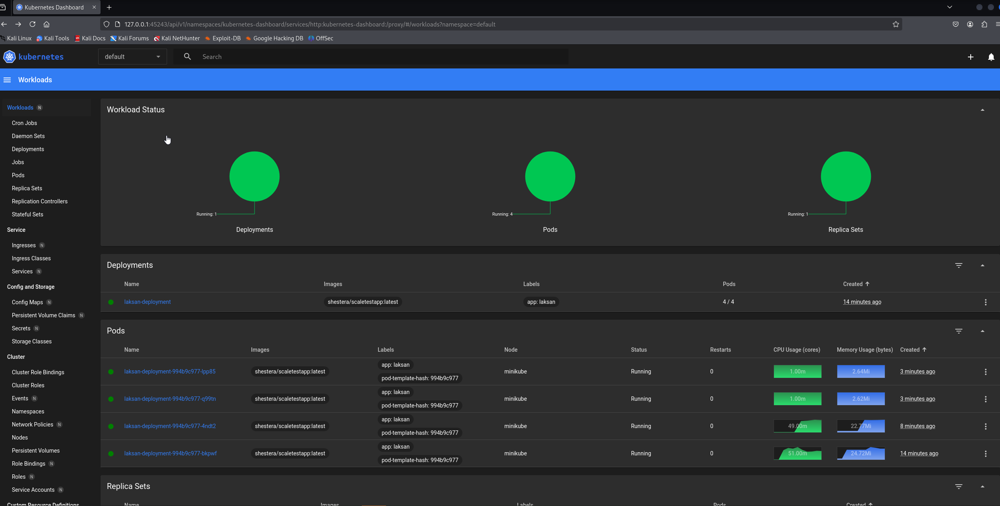

Скриншот раздела Deployment в Dashboard
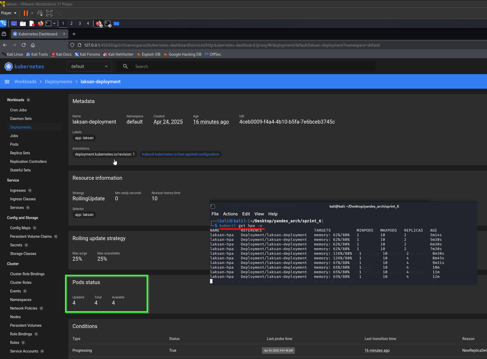

Скриншот раздела Pods в Dashboard
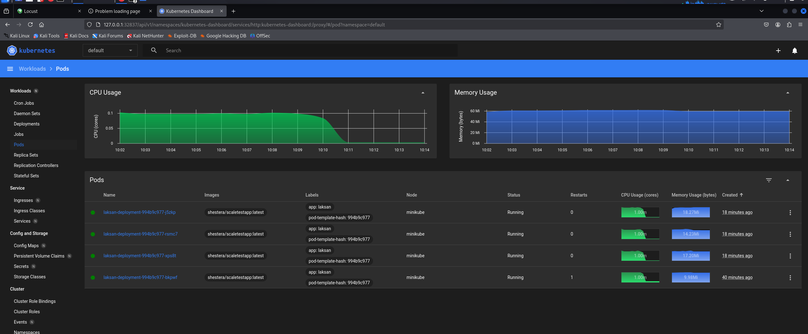

Скриншот раздела Pods в Dashboard при увеличенной нагрузке.
В конце Timeline графиков виден скачок CPU и Memory.
Поды автоматически увеличились до 9
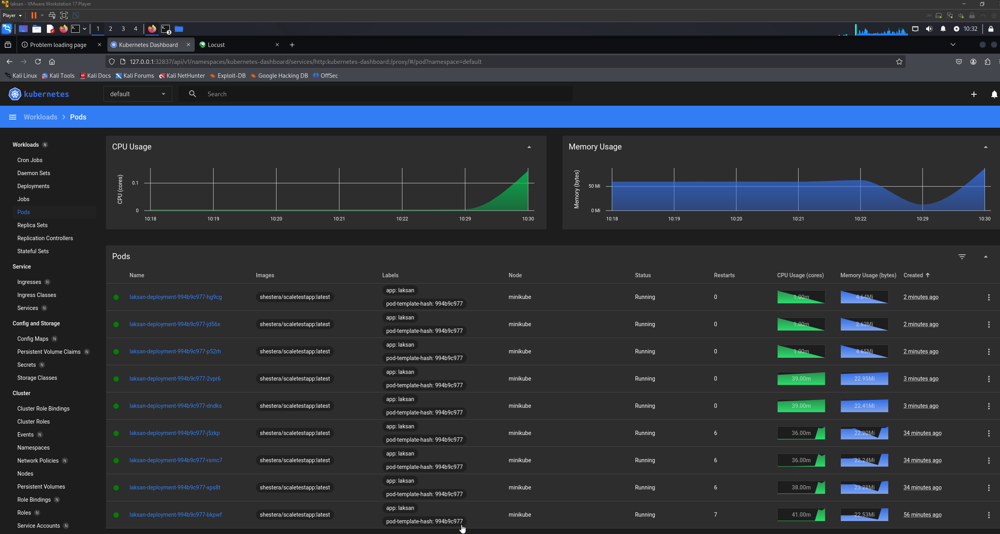

**Вывод**

🔁 HPA реагирует на нагрузку
Сначала нагрузка по памяти была 62% — HPA держал 2 реплики.

Потом утилизация выросла до 126% — HPA увеличил количество реплик до 4, чтобы справиться с нагрузкой.

Далее утилизация стабилизировалась на уровне 65–66% — ниже порога 80%, поэтому новых подов не создаётся.

## 📌 HPA = автоматическое масштабирование подов по памяти.

---

### 2. Динамическая маршрутизация на основании показателей количества запросов в секунду

1. Установил helm пакеты

2. Создал файл deployment [deployment.yaml](./2/configs/deployment.yaml)

3. Создал файл service [service.yaml](./2/configs/service.yaml)

4. Создал файл servicemonitor [servicemonitor.yaml](./2/configs/servicemonitor.yaml)

5. Создал файл adapter-values [adapter-values.yaml](./2/configs/adapter-values.yaml)

6. Создал файл adapter-values [hpa.yaml](./2/configs/hpa.yaml)

7. Создал нодовское приложение на Express, которое генерировало метрики в прометеус [index.js](./2/configs/my-node-app/index.js)

8. Сбилдил образ приложение и запушил локально в minikube

9. Проверил нодовское приложение

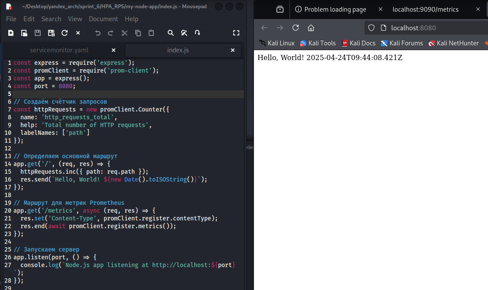

10. Запустил все файлы

11. При каждом GET запросе на localhost:8080 у нас увеличивается счетчик в прометеусе **http_requests_total**. Счетсик отображается по адресу localhost:8080/metrics

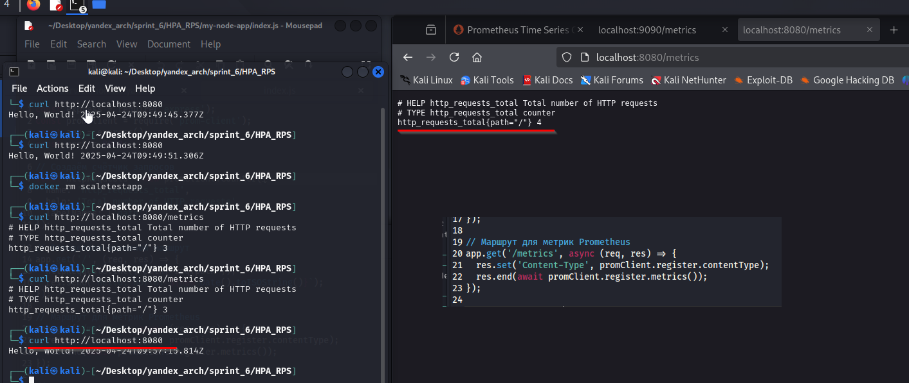

12. Заходим на /targets прометеуса. Видим успешный сервис, который отдает нам метрики **1/1 up**

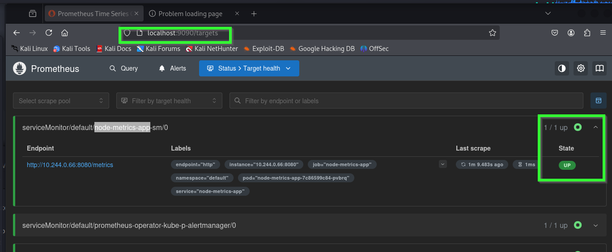

13. Запускаем **locust**. Отправляем нагрузку на url localhost:8080

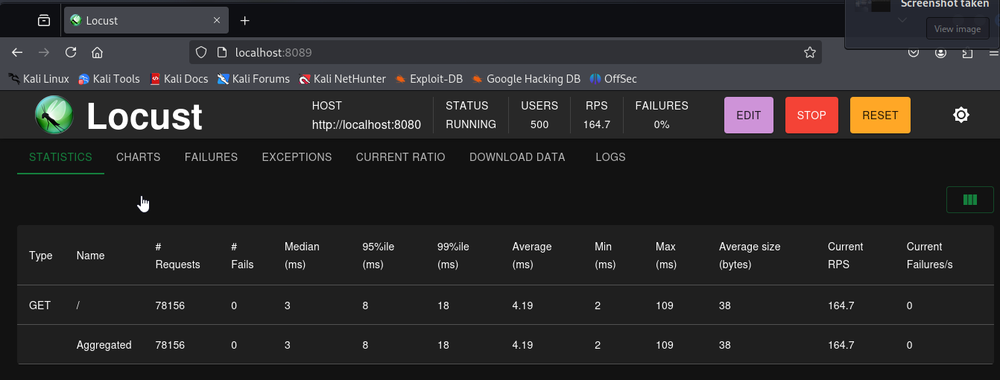

14. Смотрим, как масштабируются поды в HPA. Реплик стало 4

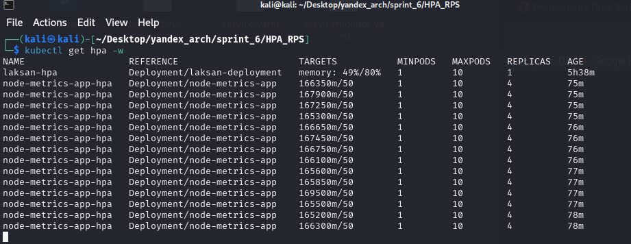

15. Заходим в dashboard для большей наглядности

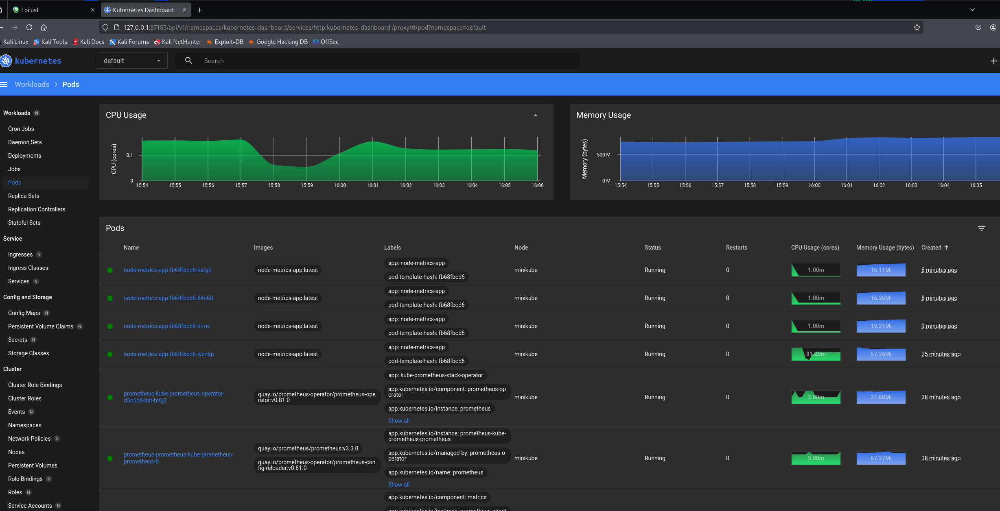

16. HPA с метриками прометеуса работают. Заходим в прометеус и смотрим статистику
    по параметру **http_requests_total**. Видим, что есть 121 тысяча записей.

    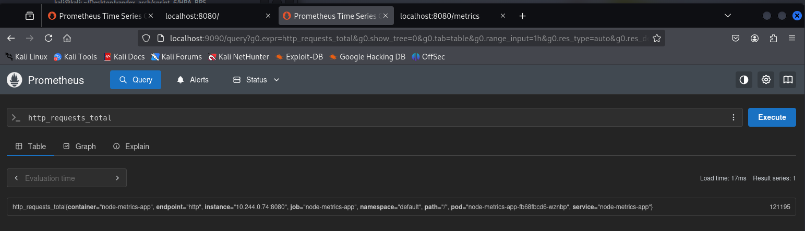

17. Решил для красоты картины, установить графану через helm для отображения метрик

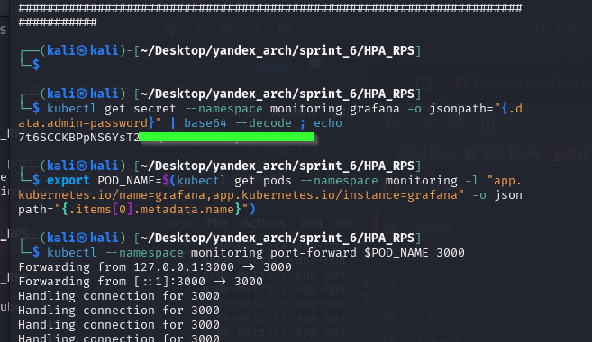

18. Dashboard в графане по фильтру **http_requests_total**

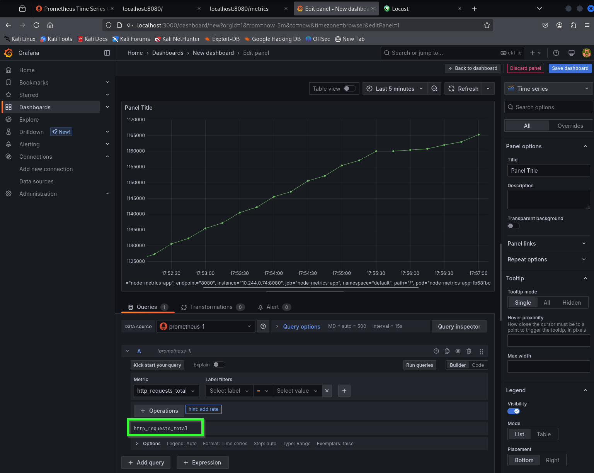

19. Увеличил нагрузку через locust. Подов стало 7.

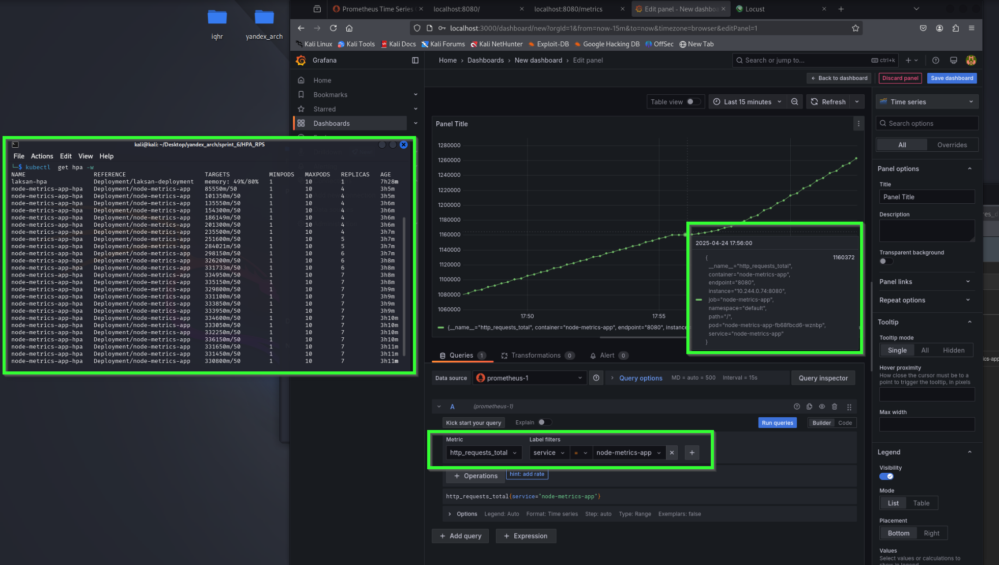
