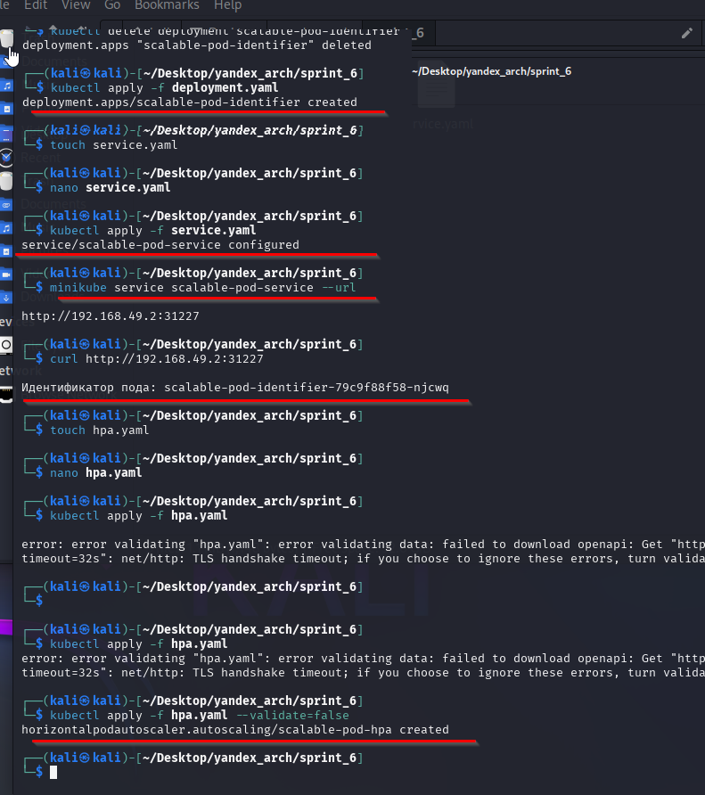
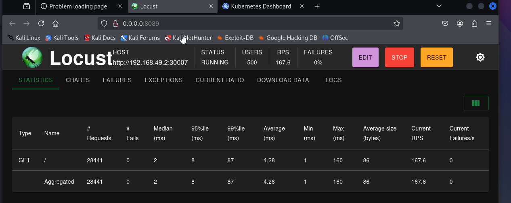
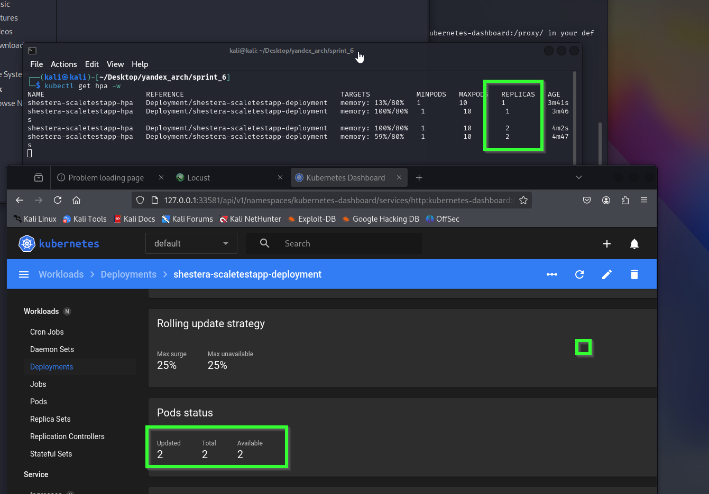

# Задание 2. Динамическое масштабирование контейнеров

### 1. Динамическая маршрутизация на основании показателей утилизации памяти

1.  Поднимаем локальный кластер Kubernetes в Minikube

```bash
minikube start
```

2. Активируем метрики

```bash
minikube addons enable metrics-server
```


3. Делаем развертывание (Deployment) Kubernetes для запуска тестового приложения

```bash
kubectl apply -f deployment.yaml
```

4. Применяем манифест Service

```bash
kubectl apply -f service.yaml
```

5. Настраиваем динамическую маршрутизацию на основании показателей утилизации оперативной памяти с помощью Horizontal Pod Autoscaler (HPA).

```bash
kubectl apply -f hpa.yaml
```

6. Активируем поддержку метрик в нашем кластере

```bash
minikube addons enable metrics-server
```

7. Сделал в 5 пункте
   

8. Проверка масштабируемости подов через нагрузку Locust

```bash
locust

minikube dashboard
```





---

### 2. Динамическая маршрутизация на основании показателей количества запросов в секунду
