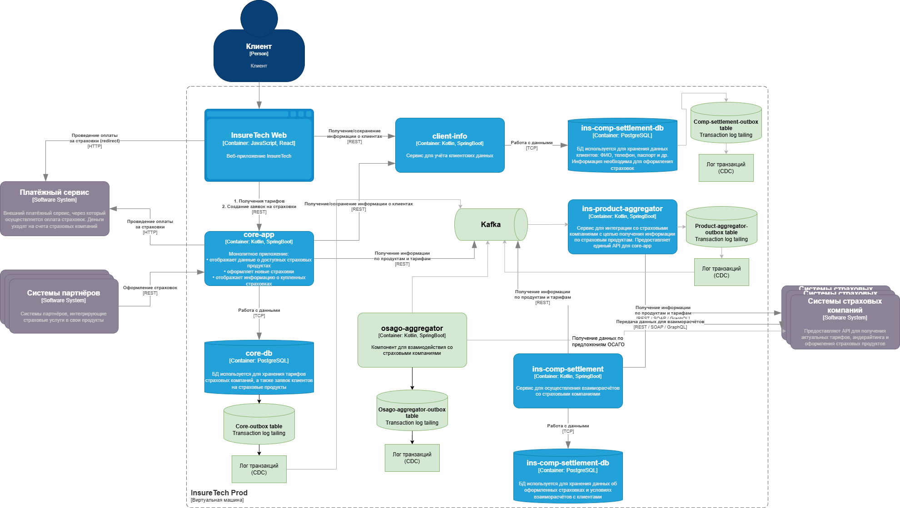

# 🧠 Задание 4. Проектирование продажи ОСАГО

---

## 1. 📦 Реализация `osago-aggregator`

- `osago-aggregator` — новый выделенный микросервис, отвечающий за отправку заявок в страховые компании и опрос их решений.
- Основные функции:
  - Создание заявок на ОСАГО.
  - Асинхронный опрос страховых компаний.
  - Агрегация и передача ответов в `core-app`.

---

## 2. 🗃 Требуется ли `osago-aggregator` своё хранилище данных?

Да, необходимо.

- Причины:
  - Хранение состояния заявок до получения всех ответов.
  - Возможность ретраев и таймаутов.
  - Логирование ошибок и статусов по страховым.
- Основные сущности:
  - `OsagoRequest`
  - `InsurerResponse`
  - `PollingStatus`
  - `RetryLog`

---

## 3. 🧩 Какой API `osago-aggregator` предоставляет `core-app`?

- `POST /api/v1/osago/requests` — создать заявку и инициировать процесс получения предложений.
- `GET /api/v1/osago/requests/{id}/responses` — получить все доступные предложения по заявке.
- Возможен Webhook `POST /core-app/webhook/osago-response` — для отправки ответов в реальном времени (опционально).

---

## 4. 🔄 Средство интеграции между `core-app` и `osago-aggregator`

- Основной способ интеграции — **message broker (Kafka)**.

  - Обеспечивает **асинхронное взаимодействие** между сервисами.
  - Подходит для **высоконагруженной системы** с большим числом параллельных заявок (2.5k одновременных пользователей).
  - Поддерживает **масштабирование**, **гарантированную доставку сообщений**, **ретраи**, **очередность обработки**.

- Поток сообщений:

  - `core-app` публикует заявку на Kafka-топик `osago.createRequest`.
  - `osago-aggregator` подписан на этот топик и начинает обработку (отправка заявок в страховые).
  - После получения оффера `osago-aggregator` публикует событие `osago.offerReady`.
  - `core-app` подписан на `osago.offerReady` и обновляет UI (через SSE/WebSocket/polling).

### Диаграмма взаимодействия в PlantUML

```plaintext
+---------------+        +-------------------+        +------------------------+
|   core-app    |  <----> |  osago-aggregator  |  <----> |   Страховые компании   |
+---------------+        +-------------------+        +------------------------+
        |                        |                          |
        | HTTP запросы           | Kafka          | REST API
        | (интерфейс API)        | (Message Broker)         | (интерфейс API)
        v                        v                          v
+---------------+        +-------------------+        +------------------------+
|  Веб-приложение| <----> | core-app (API)     | <----> | osago-aggregator        |
+-----
```

---

## 5. 🌐 API для веб-приложения в `core-app`

- `POST /osago` — создать заявку, получить `request_id`.
- `GET /osago/{request_id}/responses` — получать предложения по мере поступления.
- Возможен `GET /osago/{request_id}/stream` — SSE/WebSocket-поток с ответами.

---

## 6. 🔌 Средство интеграции между веб-приложением и `core-app`

- Базово — **REST API**.
- Для отображения предложений в реальном времени — **SSE** :
  - позволяет обновлять UI без ручного опроса;
  - снижает нагрузку и увеличивает отзывчивость;
  - требует поддержки на фронтенде.

---

## 7. 🛡 Паттерны отказоустойчивости и их применение

### 🔁 Retry

- Применяется в `osago-aggregator` при опросе страховых компаний.
- С ограничением количества попыток и экспоненциальной задержкой.

### ⛔ Circuit Breaker

- Между `osago-aggregator` и страховыми API.
- Защищает от перегрузки при массовых сбоях у конкретного поставщика.

### ⏱ Timeout

- На все внешние вызовы (`insurers`, `core-app`, `web-client`).
- Время ожидания не должно превышать 60 секунд на всю цепочку.

### 🚦 Rate Limiting

- На входящий трафик от партнёров и пользователей (через API Gateway/Ingress).
- Также на REST-запросы к страховым — чтобы избежать блокировок с их стороны.

---

## 8. ⚙️ Влияние многократного деплоя экземпляров сервисов

- Все сервисы масштабируются горизонтально (Kubernetes).
- Важно обеспечить:
  - идемпотентность запросов (особенно в `osago-aggregator`);
  - синхронизацию через очередь/базу (для управления состоянием заявок);

---

[Диаграмма "Проектирование продажи ОСАГО"](./task4.drawio)


